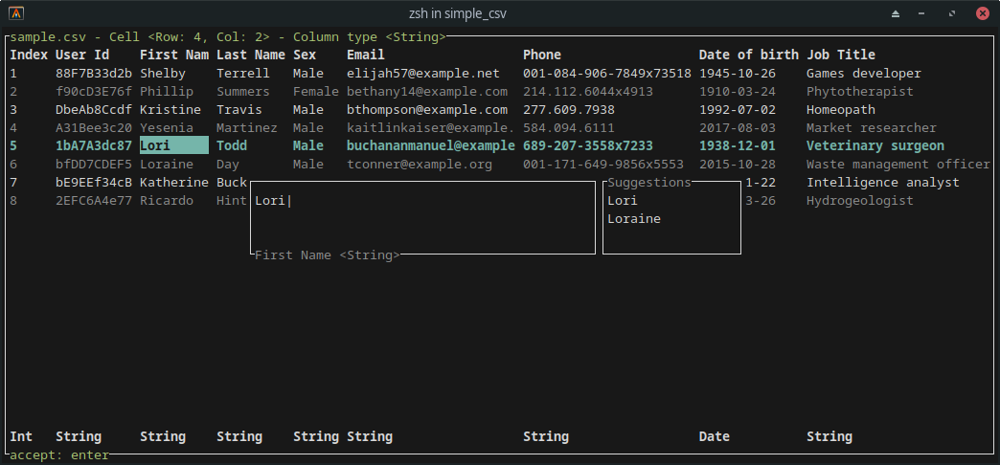

# Simple Csv Terminal Application

Tui app to quickly create/edit small csv tables and export them into more useful formats.
The main drawback is that atm all values are treated as strings.
Typed columns maybe later. Also no mouse support yet.

## v0.2.0
- switch data layer to custom dataframe
- Added typed columns (int, float, bool, string, date)
- some fixes and behaviour improvements

## Install
`cargo install --git https://github.com/florianfelix/simple_csv --locked`

## Usage
`scsv <filename> <delimiter>`

if delimiter is ommitted the default delimiter is `,` for now

## Keybindings
`?` for help

### keybindings file
Save the default keybindings with ctrl-k into `$XDG_CONFIG_HOME/simple_csv/keymap.toml`.
The config file is hot reloaded.

### export
- csv: ctrl-s
- toml: ctrl-t
- json: ctrl-j
- yaml: ctrl-y
- ron: ctrl-r
